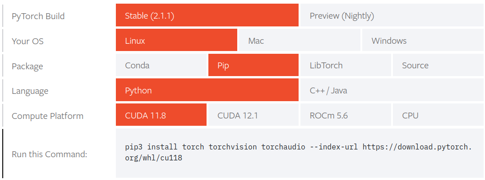

# Section 2 Install python dependencies. 

1) Python library dependencies were installed into conda working environment.
These include:
* Matplotlib for visualization of data, 
* Numpy for data organization e.g. arrays, 
* pylzma compression algorithm, 
* ipykernel for importing Google Colab GPU in order to train data with cuda and jupyter notebook for recording progress.

```
pip3 install matplotlib numpy pylzma ipykernel jupyter
```

2) Install pytorch's python3 packages. PyTorch is a framework renowned for utilizing GPUs and CPUs for machine learning projects.

Based on the following section in the Pytorch documentation for starting [locally](https://pytorch.org/get-started/locally/)<sup>[1]</sup>, the cuda cores from Google Colab's GPU can be imported into the conda working environment by installing the following:



```
pip3 install torch torchvision torchaudio --index-url https://download.pytorch.org/whl/cu118
```

## REFERENCES
[1]
“PyTorch,” www.pytorch.org. https://pytorch.org/get-started/locally/

‌