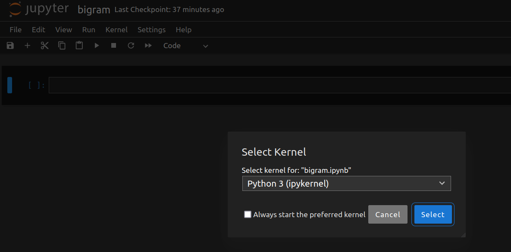
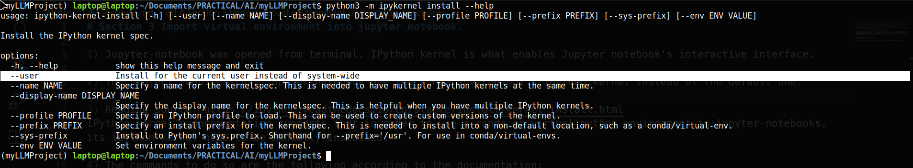
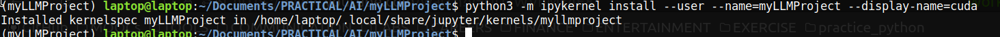
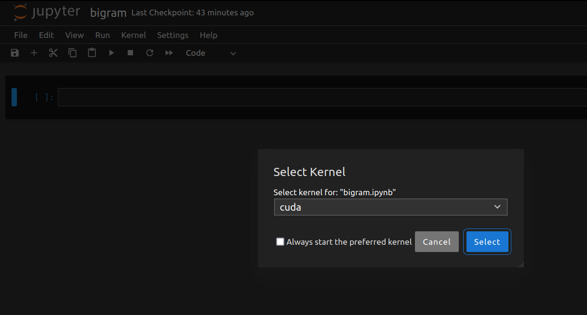

# Section 3 Import virtual environment into jupyter notebook.

1) IPython kernel is what enables Jupyter notebook's interactive interface. Open Jupyter notebook.
Inside Jupyter-notebook, navigate to Kernel --> Change kernel. The dropdown suggests that the only kernel is the default one. There is no conda environment kernel in the notebook.



2) Since PyTorch was installed into the conda environment, its ipython kernel can access the Google Colab GPU cuda cores. The default kernel in jupyter notebook cannot, however. IPython kernel's [documentation](https://ipython.readthedocs.io/en/stable/install/kernel_install.html)<sup>[1]</sup> suggests that in order to use a conda or virtual python environment in jupyter-notebooks, its ipython kernel need to be manually installed.

The commands to do so are the following: 

(Explanation of python3 -m option. The --help manual states the option as to "run library module as a script."
This is because most python modules are script files. Python requires the path to a script for execution i.e.
python3 /path/example.py. -m option allows the module script to be executed without specifying the full path.
It is the command line equivalent to import x, y, z etc module.)

Run the following in terminal.
```
#Syntax
#python3 -m ipykernel install --user --name=<conda environment> --display-name=<any name of choice>

python3 -m ipykernel install --user --name=myLLMProject --display-name=cuda
```
### Explanation of parameters



* --user option limits conda environment installation for the current user, instead of system wide.
* --name option selects the conda environment. I should be the name of the conda environment, in this case, myLLMProject
* --display-name option can be any name that helps you distinguish the conda environment's ipykernel from others on system, in this case, cuda.



3) After installation, navigate to Kernel --> Change kernel again inside Jupyter notebook, the conda environment kernel should be now present.



## REFERENCES
[1]
“Installing the IPython kernel — IPython 8.13.2 documentation,” ipython.readthedocs.io. https://ipython.readthedocs.io/en/stable/install/kernel_install.html