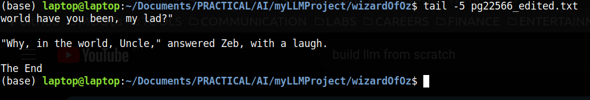

# Section 4 - Bigram model
The aim is to collect a small dataset from the book "Dorothy and the Wizard in Oz" by Frank Baum, and use it to train a bigram language model.

## Language Models - Background Research

### Bigram and other N-gram language models
From the book, ["Statistics for Linguists An Introduction Using R"](https://dlf.uzh.ch/openbooks/statisticsforlinguists/chapter/n-grams/), Chapter III Section 8, the fundamental facts about English language is that:

* Word order matters. English sentence typically follows the pattern of subject-verb-object.
* Each word of a sentence is therefore not independent from the probability of previous word.
* After the 1st word of a sentence, the 2nd word has a highe probability of being a verb than another noun.

Hence, the English language is based on conditional probability. Hence English is usually modelled statistically using n-gram models, where n number of words influence the next word in the sequence forming a sentence.[1]

A very simple model to epxress this is the bigram model where n is 2, such that the next word of the sequence is only
influenced by the previous word. It is summarized by the following formula:

(Burrowed from "Statistics for Linguists" Chapter III Section 8 pg79)

### How GPT works
GPT are a type of Large Language Models(**LLM**), neural networks optimized for Matural Language Processing(**NLP**) tasks, in order to enable humans to interact with machines in a more natural way through spoken languages. **GPT** stands for Generative Pre-trained Transformers.

The transformer architecture works through 2 components, **encoder** & **decoder**. 

The encoder takes text input from humans, break them down into a sequence of vectors that numerically represent meaning of texts, these are known as **embeddings**. The decoder will use these embeddings to predict the next word in sequence, based on relationships and dependencies from previous words.

This process is greatly enhanced by the [attention](https://arxiv.org/abs/1706.03762) mechanism. It helps the LLM to take account of the global context of certain words in the entire text input, regardless of its distance from the other words it is strongly related to. Hence capturing "long-range dependencies."[3]

For example an n-gram model where n=3 (trigram) only examines a word based on the 2 previous words. Therefore, in a sentence like:

> "A great tasting bitter melon!"

The trigram will fail to associate the melon as good tasting because "tasting" and "bitter" is before the melon.

However, if a GPT with attention is deployed, it will correctly associate the melon with "great" regardless of distance between the 2 words in sentence.

### Tokenization
For a LLM to proces language, its input has to be broken down into smaller units.
The basic unit for LLM to process language is termed **token**.
Tokenization refers to the splitting of input texts into tokens for LLM models to better process.[4]

## Bigram construction
1) Download the book, "Dorothy and the Wizard in Oz" by L. Frank Baum for free from [PROJECT GUTENBERG](https://www.gutenberg.org/ebooks/22566) as a utf-8 plain text document, as pg22566.txt[2]

2) Edit pg22566.txt by cutting out the texts before this passage:

>  DOROTHY AND THE WIZARD IN OZ
>  
>  BY
>
>  L. FRANK BAUM
>
>  AUTHOR OF THE WIZARD OF OZ, THE LAND OF OZ, OZMA OF OZ, ETC.
>
>  ILLUSTRATED BY JOHN R. NEILL
>
>  BOOKS OF WONDER WILLIAM MORROW & CO., INC. NEW YORK

3) Also delete the texts after the end of the book. i.e. Texts starting after:

> "Why, in the world, Uncle," answered Zeb, with a laugh.
>
> The End

4) Save the edited pg22566.txt file as pg22566_edited.txt. A copy can be found in the /wizardOfOz folder in this repository.

5) Use head command to check that the start of pg22566_edited.txt looks like the following.

6) Use tail command to check that the end of pg22566_edited.txt looks like the following.

7) Wizard of Oz was then opened in jupyter notebook and its contents converted from string data into a list of all the characters that appeared in the book, ordered alphabetically. These individual characters will be used as the tokens used to train the bigram model.

8) 

## REFERENCES

[1]
D. G. Schneider and M. Lauber, “N-Grams,” dlf.uzh.ch, 2020, Accessed: Nov. 29, 2023. [Online]. Available: https://dlf.uzh.ch/openbooks/statisticsforlinguists/chapter/n-grams/

‌[2]
L. F. (Lyman F. Baum and J. R. (John R. Neill, Dorothy and the Wizard in Oz. 2007. Accessed: Nov. 29, 2023. [Online]. Available: https://www.gutenberg.org/ebooks/22566

[3]
A. Vaswani et al., “Attention Is All You Need,” arXiv.org, Dec. 05, 2017. https://arxiv.org/abs/1706.03762

[4]
johnmaeda, “LLM AI Tokens,” learn.microsoft.com, May 23, 2023. https://learn.microsoft.com/en-us/semantic-kernel/prompt-engineering/tokens

‌