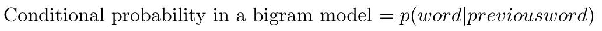
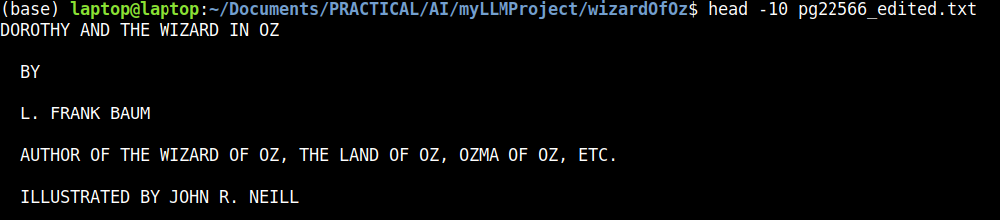

# Section 4 - Bigram model
The aim is to collect a small dataset from the book "Dorothy and the Wizard in Oz" by Frank Baum.
Then construct a bigram model of it.

## Language Models - Background Research
Reading Source: 

https://dlf.uzh.ch/openbooks/statisticsforlinguists/chapter/n-grams/ (Statistics for Linguists online book)

https://www.khanacademy.org/math/ap-statistics/probability-ap/stats-conditional-probability/a/check-independence-conditional-probability

From the book, "Statistics for Linguists An Introduction Using R" Chapter III Section 8, the fundamental facts about English language is that:

* Word order matters. English sentence typically follows the pattern of subject-verb-object.
* Each word of a sentence is therefore not independent from the probability of previous word.
* After the 1st word of a sentence, the 2nd word has a highe probability of being a verb than another noun.

Hence, the English language is based on conditional probability. Hence English is usually modelled statistically using n-gram models, where n number of words influence the next word in the sequence forming a sentence.

A very simple model to epxress this is the bigram model where n is 2, such that the next word of the sequence is only
influenced by the previous word. It is summarized by the following formula:

(Burrowed from "Statistics for Linguists" Chapter III Section 8 pg79)

## Bigram construction
1) Download the book, "Dorothy and the Wizard in Oz" by L. Frank Baum for free from [PROJECT GUTENBERG](https://www.gutenberg.org/ebooks/22566) as a utf-8 plain text document, as pg22566.txt

2) Edit pg22566.txt by cutting out the texts before this passage:

>  DOROTHY AND THE WIZARD IN OZ
>  
>  BY
>
>  L. FRANK BAUM
>
>  AUTHOR OF THE WIZARD OF OZ, THE LAND OF OZ, OZMA OF OZ, ETC.
>
>  ILLUSTRATED BY JOHN R. NEILL
>
>  BOOKS OF WONDER WILLIAM MORROW & CO., INC. NEW YORK

3) Save the edited pg22566.txt file as pg22566_edited.txt. A copy can be found in the /wizardOfOz folder in this repository.

Below shows the starting format of the edited file.

2) 

