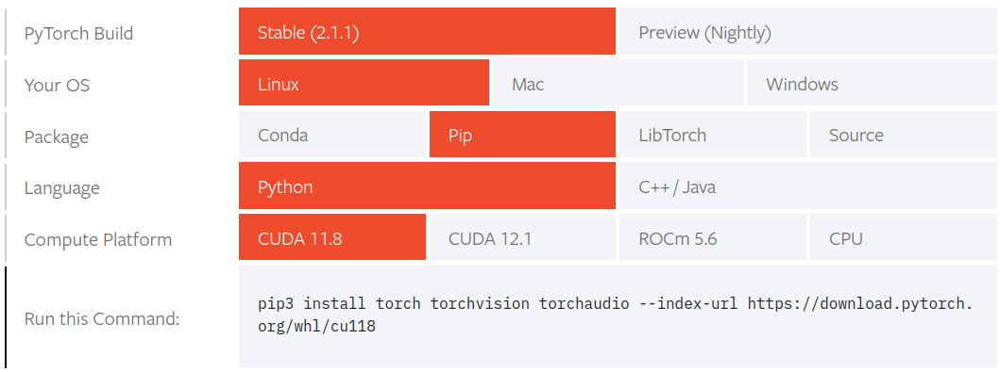

# myLLMProject
Freecodecamp guided project to build LLM from scratch
See /Notes directory for a breakdown of knowledge learnt during each section of course.

## System Information
The project content can be reproduced to run on Windows, Mac and Linux OS, provided that dependencies are met.

Google Colab GPUs were imported into the ipykernel of the conda working environment through Pytorch API.

The PyTorch build for the system is shown below:

## Prerequisite installations
The following software packages were required:
* Miniconda 23.10.0 
* VMWare Workstation Player 17
* VScodium version 1.84.0.23306
* Microsoft C++ Build Tools for Visual Studio Code(Windows users)
* python3 version 3.10 and newer.
* python3 pip
* jupyter notebook version 7.0.6

The following python libraries were required:
* matplotlib (version 3.8.2)
* numpy (version 1.26.2)
* pylzma (version 0.5.0)
* ipykernel (version 6.27.1)
* jupyter (version 1.0.0)
* pytorch (cuda version 11.8)

## Instructions
For a detailed breakdown of steps required to reproduce this project, please navigate to the /Notes directory of this repository and read through each section.

